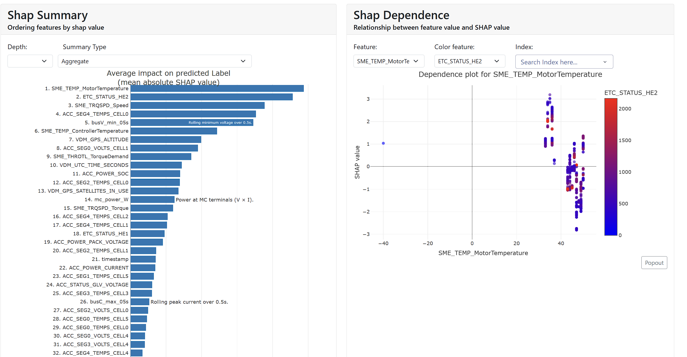
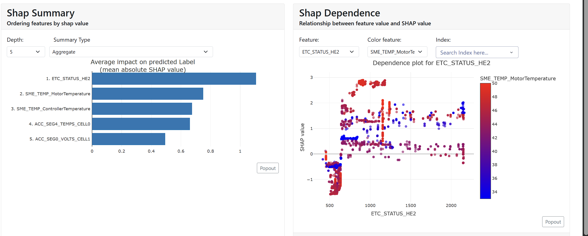
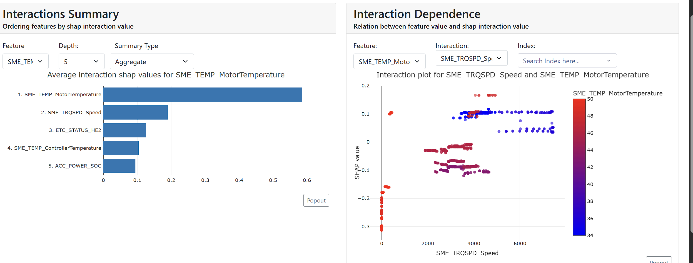
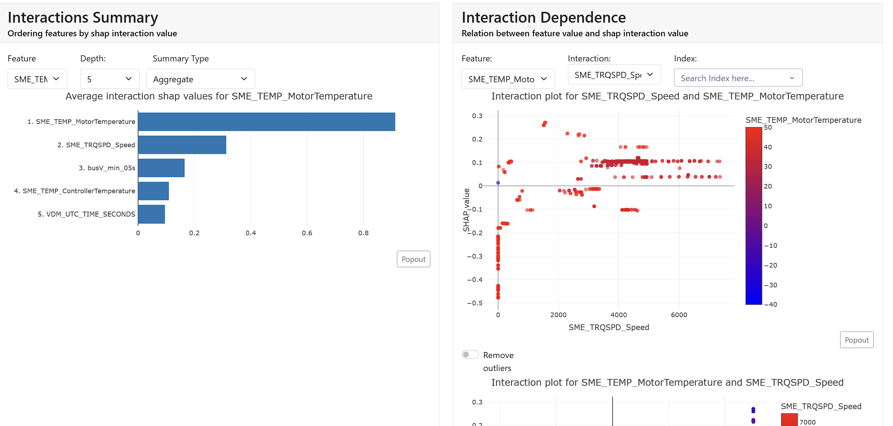

# Explainer Dashboard Analysis - Visual Evidence

## Early in Session Scenario

Faults from beginning of test sessions (before thermal buildup).

### SHAP Summary - Motor Temperature
![Early in Session SHAP Summary]

Red dots (high temp) push toward fault. Blue dots (low temp) push toward normal. Color bar shows throttle position (red = high throttle).

---

## High Torque Scenario

Faults when torque demand is high (>50%).

### SHAP Summary - Throttle Position
![High Torque SHAP Summary]

Throttle position is the #1 predictor even in high-torque scenarios. Red dots (high throttle) push toward fault, blue dots (low throttle) push toward normal.

---

## Very High Current Scenario

Faults during extreme load (>300A).

### SHAP Interaction - Motor Temp × Speed
![Very High Current Interaction]

Shows that motor temperature and motor speed interact: faults happen when BOTH are high (red dots upper right). Low speed + high temp (upper left, blue) doesn't cause faults even at extreme current levels.

---

## Large Voltage Drop Scenario

Faults where voltage drop is already visible (>5V).

### SHAP Interaction - Motor Temp × Speed

Same pattern even when voltage drop is high: high temp + high speed (red dots) predict faults. Low speed doesn't cause faults even when temp is elevated (blue dots scattered left).

---

## Key Findings

**Across all 4 scenarios:**
1. Motor temperature is consistently a top predictor
2. Throttle/speed matter when combined with temperature
3. The interaction plots prove: **High temperature + High speed = Fault**
4. This pattern holds regardless of torque demand, current level, or voltage drop

**What this rules out:**
- Bad wires (voltage drop doesn't predict faults)
- Load-only effects (happens at extreme current but still needs high temp + speed)
- Single-factor issues (requires both temperature AND speed/throttle)

**Conclusion:** Fault is triggered by **high motor temperature + high speed/throttle combination**, not by connection resistance.
