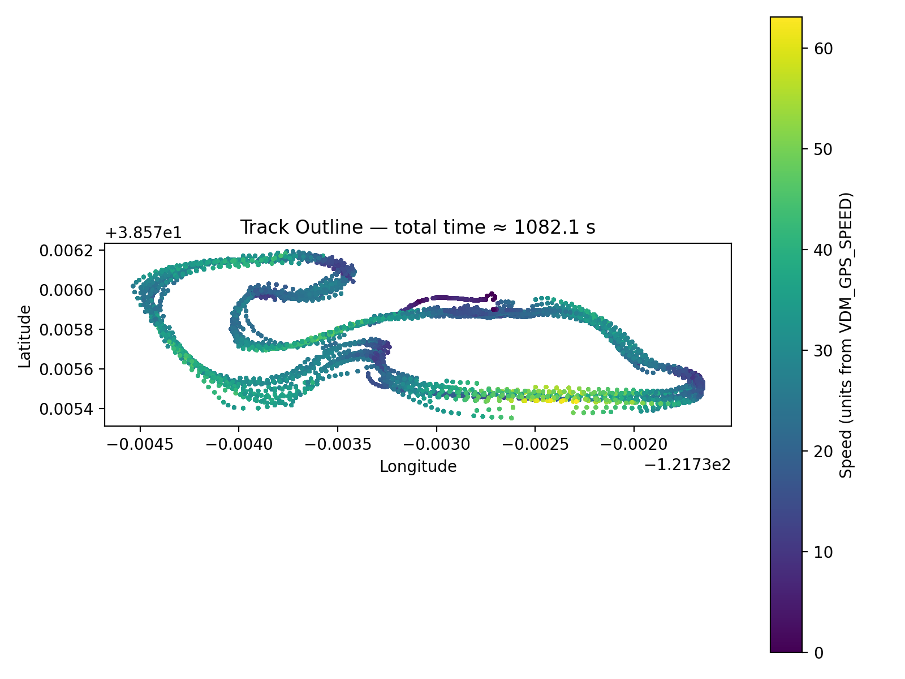

# Sal Main File Docs

HOW TO USE:
Open the file main_blue_max.py and head to line 42, replace the file name with the one you want to visualize. Run the program and you will get 10 images that pop up in different tabs.

