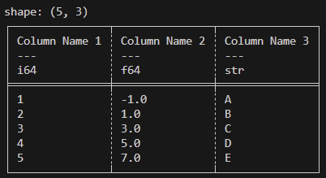
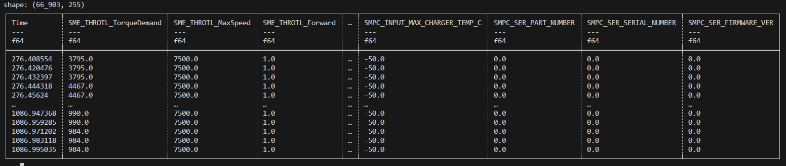

# A Guide to Polars for FS

1. [Basics of DataFrames](#bodf)
1. [Finding the data you want](#0)
1. [Why Polars?](#1)

<h2 id="bodf"> Basics of Data Frames </h2>

A concept shared across multiple different data parsing libraries is the ```DataFrame```. It is described in terms of rows and columns. Every column (known in Polars as ```Series```) has a name/id and a datatype (int 32, float 64, string, etc.) and the entire ```DataFrame``` has a number of rows (Each column must have the same # of rows). This looks something like:



Our data tends to look more like:



<h2 id="0"> Finding the data you want </h2>

I will generally refer to dataframes as ```df```.

### Reading files

```python
path = "FS-3/08102025/08102025Endurance1_FirstHalf.parquet" 
path2 = "FS-3/08102025/08102025DoesNotExistLol.csv" 

# A little tip for windows vscode users: When you select "copy path" on a file it uses  backslashes which you then have to fix. If you instead just copy as if you were going to copy the entire file, and paste it into the editor, it pastes the path with forward slashes!

# Read files with .read_parquet or .read_csv
dfa = pl.read_parquet(path)
dfb = pl.read_csv(path2)

# Stack two dataframes vertically (eg. two parts of the same run) with .vstack
df = dfa.vstack(dfb)

# Rename your columns
df.columns = ["altColA", "altColB", . . .]
```

### Slicing

```python
df["colA"] # This gets you a specific column or "Series"
df["colA", "colB"] # This gets you a DataFrame with just these two columns
df.select(["colA", "colB"]) # This does the same thing as the line before but is more generalizeable.

df[0] # This gets you the first row as a df
df[:10] # This gets you the first 10 rows as a df

# Unfortunately, polars does not support indexing in reverse so df[-1] returns an error. In it's place you can do:
df[df.height - 1] # Get the last row
```

### Filtering

```python
df.filter(pl.col("colA") == 1) # Returns a df with all the rows where the value of colA is 1.

# To stack these, just call .filter() again!
df.filter(pl.col("Time") > 100).filter(pl.col("Time") < 200) # Get df where the time is between 100 and 200!

# You can also use some other operators like "&" and "|" for "and"/"or"
df.filter((pl.col("Time") > 100) & (pl.col("Time") < 200))
df.filter((pl.col("colA") < 10) | (pl.col("colB") != "hi"))

# There is also some logic for "if" and "else", but it is a bit awkward and uses words like "then" and "otherwise". Look it up if you want to use it and add to this doc because I currently don't have internet to check what it is!
```

### Multi Column or Relative Column Operations

A lovely thing about Polars is how you can perform simple operations between columns quickly!

```python
I = SME_TEMP_BusCurrent
V = SME_TEMP_DC_Bus_V

# Get the series that is the power value at every moment.
Power = df[I] * df[V]

# Or insert it into the dataframe itself!
df.insert_column(0, df[I] * df[V]) # In place. 0 is the index of where you want the column to end up.
or
df = df.with_columns( # Not in place so you have to set df equal to the result
    (df[I] * df[V]).alias("Power")
)

# You can also perform basic operations on columns or alter them.

df[I] * 40 # returns a Series with all the current values * 40

df = df.with_columns( # Replaces the I column with one that is multiplied by 40.
    df[I] * 40
)
```

### Useful Series Stuff

```python
s = df["colA"]
s.mean() # Mean
s.std() # Standard Deviation
s.min() # Minimum
s.max() # Maximum
s.abs() # Absolute Value (Returns a Series)
s.sqrt() # Square Root (Returns a Series)
s.sample(n = 2, with_replacement = False) # Samples 2 values (Returns a Series)
```

To get a look at this in action, take a look at [imuCalibration.py](../imuCalibration.py)

<h2 id="1"> Why Polars? </h2>

It is significantly faster than Pandas and is the thing we started out using so we're gonna keep using it! 

