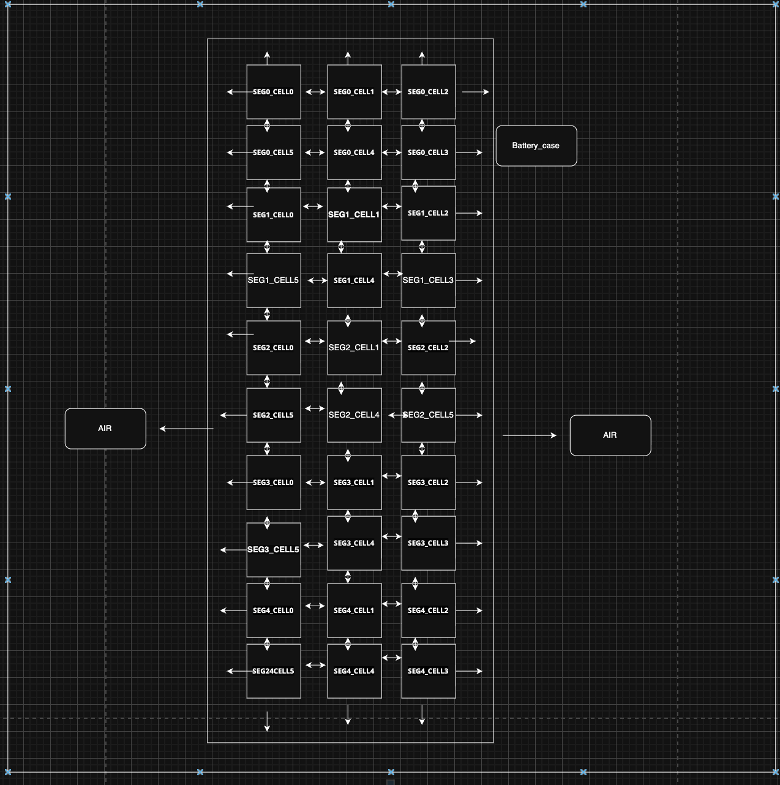

## Battery thermal schematics

This diagram is a **lumped thermal network** view of a battery pack: nodes represent temperatures (packs, case, ambient), and arrows show **where conductive or convective heat transfer is modeled** between those nodes.

### What the blocks represent

- **Battery_case** — The enclosure around the pack stack. In a simulation it is usually a single thermal mass (or a small set of masses) whose temperature couples perimeter packs and exchanges heat with the outside.
- **AIR** — The external fluid region on the **left and right** sides of the case. It is the sink (or source) for heat that leaves the pack through the case sides.

### Pack layout and naming

- Packs are arranged in a **3 columns × 10 rows** grid inside the case (30 packs total).
- The pack is split into **five segments**, **SEG0** through **SEG4**. Each segment has **six packs** in a **2×3** arrangement (two rows of three).
- Within a segment, packs are labeled **CELL0 … CELL5** in the schematic, following the pattern in the figure: top row **0, 1, 2** and bottom row **5, 4, 3** (so the horizontal order of indices differs between rows).

Full pack IDs follow: **`SEG<segment>_CELL<index>`** (for example `SEG0_CELL0`, `SEG1_CELL3`). The `CELL` suffix matches the figure labels; each node is one **2×10p pack**, not a single Li-ion cell.

### How to read the arrows (heat transfer paths)

Arrows indicate **modeled heat flow directions** in the thermal circuit—not necessarily instantaneous physical flow at every instant (heat can still move “backward” through a resistance if the temperature gradient reverses). In practice:

1. **Pack ↔ pack (double-headed arrows)**  
   - **Horizontal:** Between neighbors in the same row (e.g. `SEG0_CELL0` ↔ `SEG0_CELL1` ↔ `SEG0_CELL2`, and similarly on the bottom row).  
   - **Vertical:** Between the two rows within a segment, and **between the bottom of one segment and the top of the next** (e.g. down the stack from SEG0 through SEG4).  
   These paths represent **in-pack conduction** (and any equivalent series path through gaps, frames, or busbars, depending on how the model is parameterized).

2. **Pack → Battery_case (single-headed arrows from packs outward)**  
   **Perimeter packs** connect to the case on the **outer boundary** of the grid:  
   - **Top** row of SEG0 → case above  
   - **Bottom** row of SEG4 → case below  
   - **Left** column (the packs on the left edge of the 3-wide grid) → case on the left  
   - **Right** column (the packs on the right edge) → case on the right  

   Interior packs only “see” the case indirectly through other packs unless the model adds extra paths. These links are the **pack-to-housing** thermal resistances.

3. **Battery_case → AIR (single-headed arrows from case to the side AIR blocks)**  
   Large arrows from the **vertical sides** of the **Battery_case** to **AIR** represent **heat rejection** from the pack shell to the ambient at the sides—typically **convection** (and any explicit **radiation** if folded into the same coefficient). This is where pack heat leaves to the environment in this topology.

### Airflow and airflow modeling

The schematic does **not** draw velocity fields, ducts, or fan blades. **Airflow** here means how moving air changes **heat transfer**—not a separate fluid simulation inside this lumped network.

In practice there are two related roles for air:

1. **External (case → AIR)** — Air on the **left and right** of the enclosure carries heat away from the case surface. With little or no vehicle speed, this is mostly **natural convection**; at speed, **ram air** can increase the effective heat transfer to the side **AIR** nodes (sometimes folded into the same \(h\) or an added term).

2. **Internal (fans)** — Accumulator fans push air through the pack stack (segment-to-segment along the air path). That is **forced convection** over pack and segment surfaces. In a lumped model this usually appears as **stronger coupling** between packs and/or a **higher effective \(h\)** on cooling paths—not as a mesh of air temperatures.

**How airflow is modeled** in this style of thermal network:

- Convection is written as **Newton cooling**: heat flow scales with surface area, temperature difference, and a coefficient \(h\) (see [BatteryThermal.md](../Data/BatteryThermalModel/BatteryThermal.md) for enclosure-to-air and fan-related forms).
- **Fan command** (e.g. `Fans:Value` / fan %) enters as a **parameter on \(h\)** (or on an equivalent thermal conductance): \(h = h_0 + f(\text{fan\%})\), fit from logs such as 0% vs 100% fan runs at known ambient temperature.
- **No CFD in the schematic**: mass flow, pressure drop, and duct geometry are not solved node-by-node; they are **collapsed** into \(h\), conductances, and optionally separate internal vs external resistances if the full sim needs them.

If the detailed model adds **intra-pack convection** (fan cooling between packs), that may show up as extra links or as a fan-dependent term on pack temperatures even when the figure only highlights **case → AIR** to the sides. The arrows in the diagram remain the **thermal circuit**; airflow modeling chooses the **numbers** on those convection links.

### Summary

| Path | Typical meaning |
|------|------------------|
| Pack ↔ pack | Conduction / in-pack coupling between neighboring packs |
| Pack → case | Conduction from pack stack to inner surface of the housing |
| Case → air | Convection (± radiation) from outer case to ambient; \(h\) may depend on fan % and ram air |
| (implicit) Fan-driven cooling | Forced convection inside the stack; often modeled via \(h(\text{fan\%})\) or extra pack coupling, not drawn as AIR nodes |

Together, these paths define how heat generated in each pack propagates **laterally and vertically through the stack**, then **out through the case** to **air** on the sides—matching the structure shown in the schematic.
