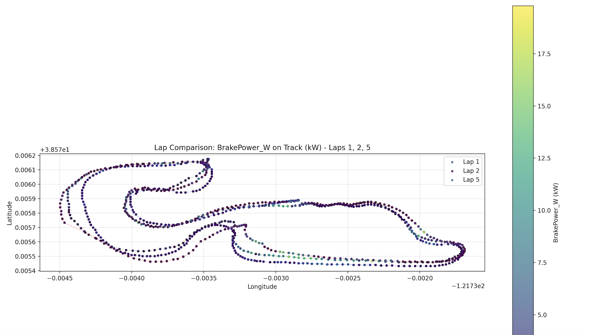
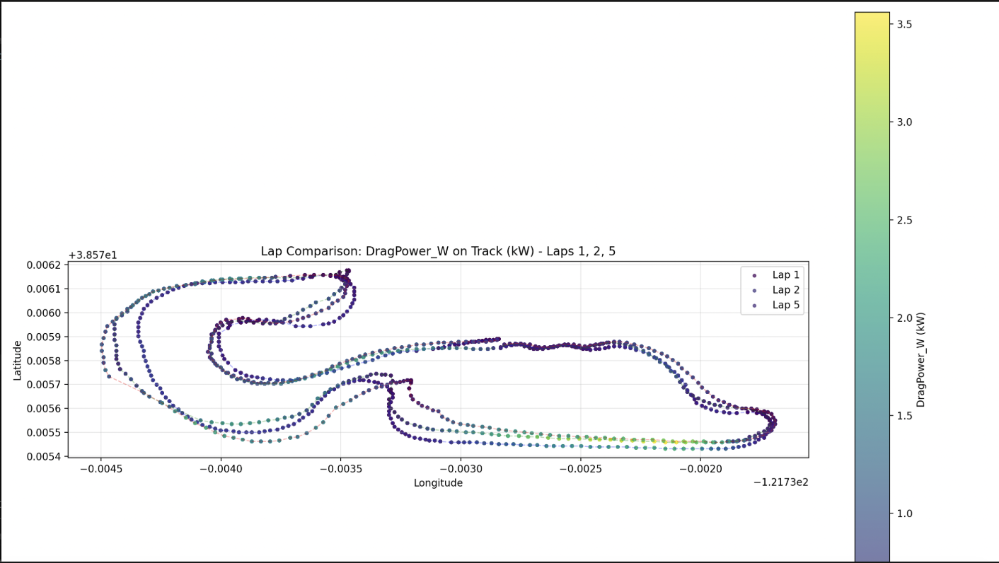

 BlueMax Track Analysis Script

To run the file:

python3 bluemax.py --file ../fs-data/FS-3/08172025/08172025_20_Endurance1P1.parquet

bluemax.py is used to track brake power, drag power, and total power loss on the track by comparing multiple laps. Laps can be altered on line 314 by changing the lap numbers being used.

The equations used for:

 Drag Force:
F_drag = (1/2) * ρ * CdA * v²
Where:
 F_drag = Drag force (N)
 ρ  = Air density (kg/m³), default = 1.225 kg/m³
CdA  = Drag coefficient × frontal area (m²), default = 0.7 m²
 v = Vehicle speed (m/s)

Drag Power:
P_drag = (1/2) * ρ * CdA * v³
Where:
P_drag = Drag power loss (W)

Brake Power:
P_brake = -m * a_long * v  (only when a_long < 0, i.e., decelerating)
P_brake = 0  (when a_long ≥ 0)
Where:
P_brake = Braking power loss (W)
m = Vehicle mass (kg), default = 300 kg
a_long = Longitudinal acceleration (m/s²)
v  = Vehicle speed (m/s)

 Total Power Loss:
P_total = P_drag + P_brake
Where:
P_total = Total power loss (W)

 Configuration:
To change which laps are compared, edit line 317 in `bluemax.py`:
comparison_laps = [1, 2, 5]  

 Command-line Arguments:
- `--file`: Path to parquet file (required)
- `--CdA`: Drag coefficient × area (m²), default = 0.7
- `--rho`: Air density (kg/m³), default = 1.225
- `--mass`: Vehicle mass (kg), default = 300.0
- `--min_lap_time`: Minimum time between lap triggers (s), default = 10.0

 Graphs:

### Brake Power Comparison

### Drag Power Comparison

### Total Loss Power Comparison

 